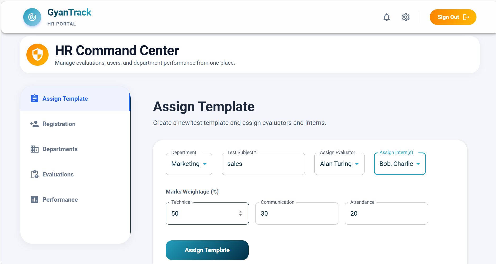
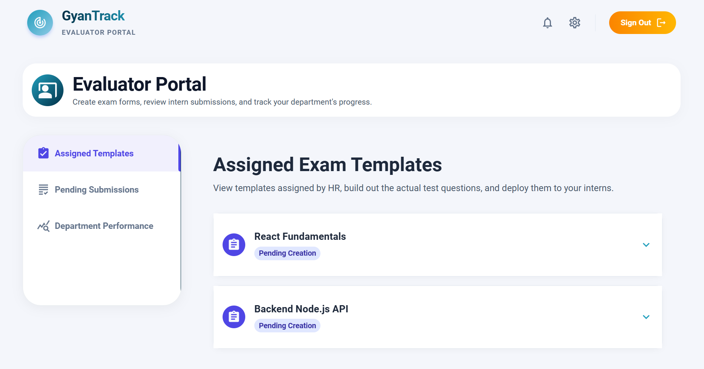
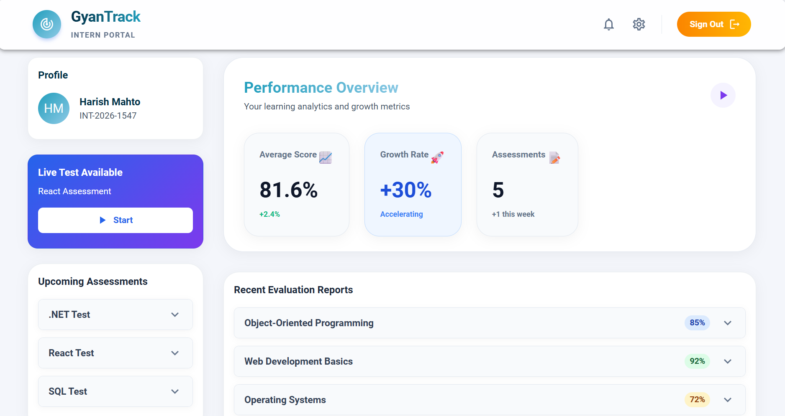
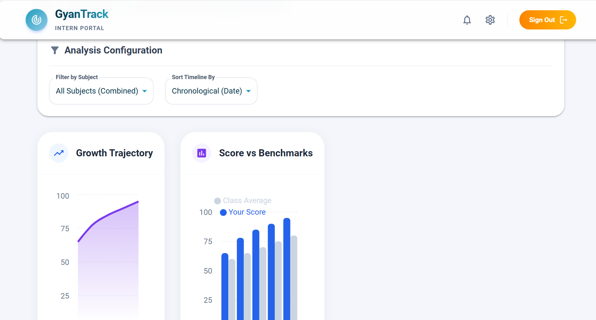

# GyanTrack - Internal Performance Management & Assessment System


**GyanTrack** is an Internal Performance Management & Assessment System designed to evaluate, monitor, and track the progress of interns across various departments within an organization. It provides a structured, proctored environment for interns to take assessments while streamlining the workflow for Evaluators and Human Resources (HR) administrators.

---

## 📸 Screenshots

Here is a glimpse of the GyanTrack system across different portals:

### HR / Admin Dashboard

*Manage users, subjects, evaluator assignments, and view department-wide analytics.*

### Evaluator Portal - Exam Builder

*Build customized assessments (MCQs), set points, and monitor live/completed intern submissions.*

### Intern Portal - Live Assessment

*Secure testing environment with real-time countdowns and proctoring metrics.*

### Analytics & Reporting

*Detailed post-test analytics, score mapping, and graphical performance breakdowns.*

---

## ✨ Core Features

### 🏢 HR / Admin Module
- **User Management:** Create and manage Interns and Evaluators.
- **Subject Creation:** Define domains of assessment (e.g., Software Engineering, System Design).
- **Template Assignment:** Create `AssignmentTemplates` dictating which Evaluator must build a test for which subject, alongside total percentage weights.
- **Department Mapping:** Cross-assign interns to specific evaluators for tracking.
- **System Analytics:** View aggregate metrics across departments.

### 📝 Evaluator Module
- **Task Management:** Evaluators are dynamically notified of pending tests they must build.
- **Exam Builder UI:** Build dynamic MCQs, set points per question, assign correct options, and finalize exams.
- **Submission Tracking:** Review intern submissions in real-time, validating responses and overall scores.

### 🎓 Intern Module
- **Interactive Dashboard:** Real-time notifications for Live, Upcoming, and Completed assessments.
- **Secure Testing Environment:** A fully interactive web-based exam client with countdown timers.
- **Anti-Cheat Mechanics:** Background tracking records tab-switches or malpractice (`visibilitychange` and `blur` events).
- **Post-Test Analytics:** Instantly displays success rates, time taken, score mapping, and graphical breakdowns.

---

## 🛠️ Technology Stack

GyanTrack utilizes a modern **Client-Server Architecture** for high scalability and clean separation of concerns.

### Frontend (Client)
- **Framework:** React.js (via Vite)
- **UI & Styling:** Material-UI (MUI) v5, Emotion CSS-in-JS, Custom Themes
- **State Management:** React Context API & React Hooks
- **Data Visualization:** Recharts
- **HTTP Client:** Axios (with JWT interceptors)
- **Routing:** React Router v6

### Backend (Server)
- **Framework:** ASP.NET Core 8.0 Web API
- **ORM:** Entity Framework (EF) Core
- **Database:** Microsoft SQL Server
- **Security & Auth:** JWT (JSON Web Tokens) Bearer Authentication, BCrypt.Net

---

## 🚀 Setup & Installation Guide

Follow these steps to get the project up and running locally.

### Prerequisites
- [Node.js v18+](https://nodejs.org/)
- [.NET 8.0 SDK](https://dotnet.microsoft.com/en-us/download/dotnet/8.0)
- SQL Server (LocalDB or Docker instance)

### 1. Backend Setup

Navigate to the API directory, restore packages, apply database migrations, and run the server.

```bash
cd GyanTrack.API
dotnet restore
dotnet ef database update
dotnet run --urls "http://localhost:5034"
```

*Note: The system automatically initializes default accounts via `SeedData` upon the very first run, giving you instant access to predefined `admin`, `evaluator`, and `intern` accounts.*

### 2. Frontend Setup

Navigate to the frontend directory, install dependencies, and start the development server.

```bash
cd GyanTrackFrontend
npm install
npm run dev
```

The React frontend should now be running (usually on `http://localhost:5173`) and communicating with your local .NET API!

---

## 🏗️ Architecture & Database

- **Architectural Pattern:** Repository Pattern + Service Layer + DTOs.
- **Database Schema:** Fully normalized relational schema separating Users (with Admin, Evaluator, Intern roles), Subjects, AssignmentTemplates, Tests, Questions, Options, and Answers.

---

## 🔒 Security

- **JWT Authentication:** Secure stateless authentication for all protected endpoints.
- **Role-Based Access Control (RBAC):** Backend isolates functions via `[Authorize(Roles="...")]` and frontend routing isolates UI via `ProtectedRoute` wrappers.
- **Password Hashes:** Passwords are hashed and salted using BCrypt.

---

*Documentation built by the GyanTrack Engineering Team.*
