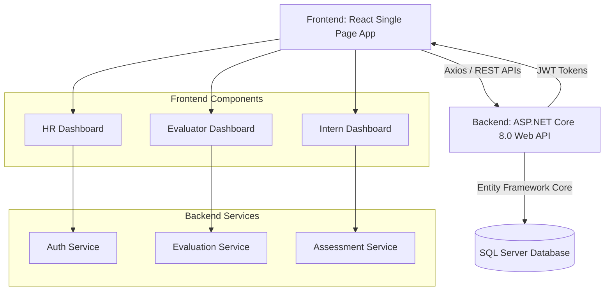

<div style="page-break-after: always;"></div>

# Table of Contents
1. [Introduction](#1-introduction)
2. [System Architecture](#2-system-architecture)
3. [Technology Stack](#3-technology-stack)
4. [Database Schema](#4-database-schema)
5. [Core Modules & Features](#5-core-modules--features)
6. [API Endpoints Reference](#6-api-endpoints-reference)
7. [Security & Authentication](#7-security--authentication)
8. [Setup & Installation Guide](#8-setup--installation-guide)

<div style="page-break-after: always;"></div>

## 1. Introduction

### 1.1 Purpose
**GyanTrack** is an Internal Performance Management & Assessment System designed to evaluate, monitor, and track the progress of interns across various departments within an organization. It provides a structured, proctored environment for interns to take assessments while streamlining the workflow for Evaluators and Human Resources (HR) administrators.

### 1.2 Scope
The system contains three primary portals:
- **Admin/HR Portal:** Manages users, subjects, evaluator assignments, and views department-wide analytics.
- **Evaluator Portal:** Receives assignment templates from HR, builds customized assessments (MCQs), and monitors live/completed intern submissions.
- **Intern Portal:** Provides a secure testing environment where interns can view upcoming tests, take proctored assessments, and review detailed scorecard analytics.

---

## 2. System Architecture

GyanTrack utilizes a modern **Client-Server Architecture** separating the frontend UI layer from the backend business logic and data persistence layers. This ensures high scalability, maintainability, and clean separation of concerns.



---

## 3. Technology Stack

### 3.1 Frontend (Client)
- **Framework:** React.js (via Vite)
- **UI Library:** Material-UI (MUI) v5
- **Styling:** Emotion CSS-in-JS & Custom Themes
- **State Management:** React Context API & React Hooks
- **Data Visualization:** Recharts (for performance analytics & pie charts)
- **HTTP Client:** Axios (with generic interceptors for JWT injection)
- **Routing:** React Router v6

### 3.2 Backend (Server)
- **Framework:** ASP.NET Core 8.0 Web API
- **ORM:** Entity Framework (EF) Core
- **Database:** Microsoft SQL Server
- **Authentication:** JWT (JSON Web Tokens) Bearer Authentication
- **Security:** BCrypt.Net (Password Hashing)
- **Architecture Pattern:** Repository Pattern + Service Layer + DTOs

---

## 4. Database Schema

The database strictly adheres to a relational schema designed for optimal normalization.

### 4.1 Key Entities
* **Users:** Core identity table (`Role` specifies Admin, Evaluator, or Intern).
* **Interns & Evaluators:** Normalizes specific properties linked to `Users`.
* **Subjects:** Master table of technical or behavioral evaluation categories.
* **AssignmentTemplates:** Created by HR. Links a Subject to an Evaluator and sets scoring weightages (e.g., Technical, Communication, Attendance).
* **EvaluatorInterns:** Many-to-Many mapping table routing specific interns to specific evaluators.
* **Tests:** Created by Evaluators against an Assignment Template. Defines duration, live windows, and passing criteria.
* **Questions & Options:** 1-to-Many relationship between a Test and questions, and a Question and its four MCQ options.
* **TestAttempts:** Records the exact timeline and score of an intern's exam.
* **Answers:** Log of the exact option an intern chose for every question.

---

## 5. Core Modules & Features

### 5.1 HR / Admin Module
- **User Management:** Create new Interns and Evaluators.
- **Subject Creation:** Define domains of assessment (e.g., "Software Engineering", "System Design").
- **Template Assignment:** Create `AssignmentTemplates` dictating which Evaluator must build a test for which subject, alongside total percentage weights.
- **Department Mapping:** Cross-assign interns to specific evaluators for tracking.
- **Analytics:** View aggregate metrics across departments.

### 5.2 Evaluator Module
- **Assigned Templates:** Evaluators are dynamically notified of pending tests they must build.
- **Exam Builder UI:** Evaluators build dynamic MCQs, set points per question, assign the correct option, and finalize the exam to "Live" status.
- **Submission Tracking:** Review all intern submissions in real-time, validating responses and overall scores.

### 5.3 Intern Module
- **Dashboard:** Features real-time notifications for Live, Upcoming, and Completed assessments.
- **Secure Testing Environment:** A fully interactive web-based exam client. Includes countdown timers and background tracking to record tab-switches or malpractice.
- **Post-Test Analytics:** Instantly displays success rates, time taken, score mapping, and a graphical breakdown of skipped vs. answered questions.

---

## 6. API Endpoints Reference

### 6.1 Authentication (`/api/auth`)
| Method | Endpoint | Description |
|--------|----------|-------------|
| POST | `/login` | Authenticates User, returns JWT & role path redirection data |
| POST | `/register` | Admin-only route to create new portal users |

### 6.2 Admin Data (`/api/admin`)
| Method | Endpoint | Description |
|--------|----------|-------------|
| GET | `/subjects` | Fetches system global subjects |
| POST | `/templates` | Creates assignment parameters for Evaluators |
| POST | `/mappings` | Maps Intern IDs to Evaluator IDs |

### 6.3 Evaluator Operations (`/api/evaluator`)
| Method | Endpoint | Description |
|--------|----------|-------------|
| GET | `/templates/assigned` | Fetches builder queue |
| POST | `/tests` | Initializes an empty exam framework |
| POST | `/questions` | Saves questions and `[{OptionText, IsCorrect}]` arrays |

### 6.4 Intern Exam System (`/api/intern`)
| Method | Endpoint | Description |
|--------|----------|-------------|
| GET | `/tests/live` | Checks available immediate exams |
| POST | `/attempts/start` | Creates a `TestAttempt` record timestamp |
| POST | `/attempts/submit` | Parses `[AnswerDTOs]`, calculates scores, commits to DB |

---

## 7. Security & Authentication

- **JWT Authentication:** All API interactions beyond `/login` require a valid JWT passed in the HTTP `Authorization: Bearer <token>` header.
- **Role-Based Access Control (RBAC):** Backend endpoints isolate functions via `[Authorize(Roles="...")]`. Frontend routing isolates UI using `<ProtectedRoute role="...">` wrappers.
- **Password Hashes:** Raw passwords are never transmitted unencrypted or stored as plaintext. BCrypt generates strong hashes combined with a random salt string per user.
- **Anti-Cheat Mechanics:** The frontend `LiveTest` UI hooks into JS `document.visibilitychange` and `blur` events.

---

## 8. Setup & Installation Guide

### Backend Prerequisites
- .NET 8.0 SDK
- MS SQL Server (LocalDB or Docker instance)

```bash
cd GyanTrack.API
dotnet restore
dotnet ef database update
dotnet run --urls "http://localhost:5034"
```

### Frontend Prerequisites
- Node.js v18+
- NPM / Yarn

```bash
cd GyanTrackFrontend
npm install
npm run dev
```

The system automatically initializes default accounts via `SeedData` upon the very first run, giving users instant access to predefined `admin`, `evaluator`, and `intern` accounts.
